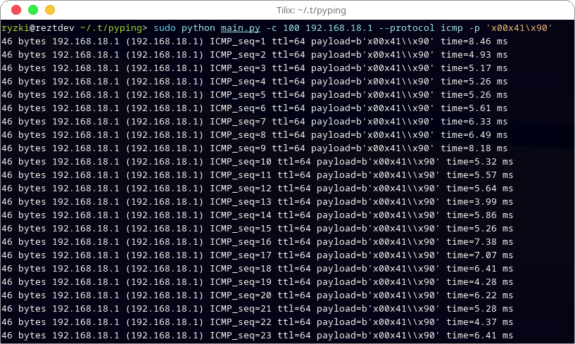
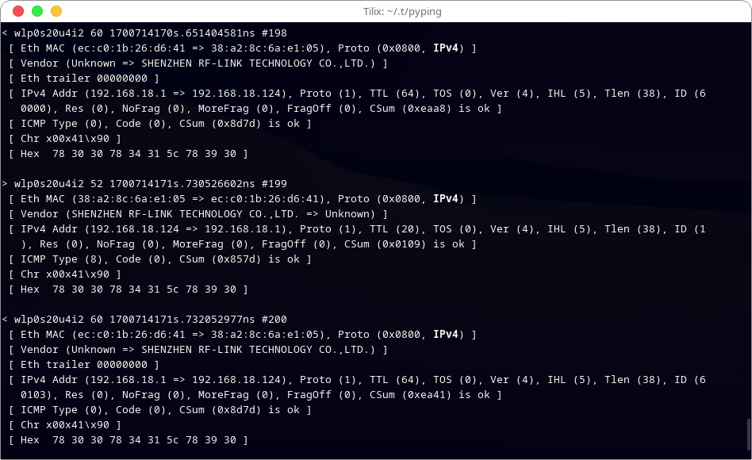

## PyPing a simple Ping Python

## How to use?

install dependencies for support this module:
```pip install -r requirements.txt```

and than, run file setup.py
```python setup.py install```

## Note!!
You need as admin or root to running this module

- You can make things as you wish
```python
from pyping import pyping

pyping.ping("www.google.com", count=5, protocol="icmp")
```

## Run script


## Result capture with Netsniff-ng

